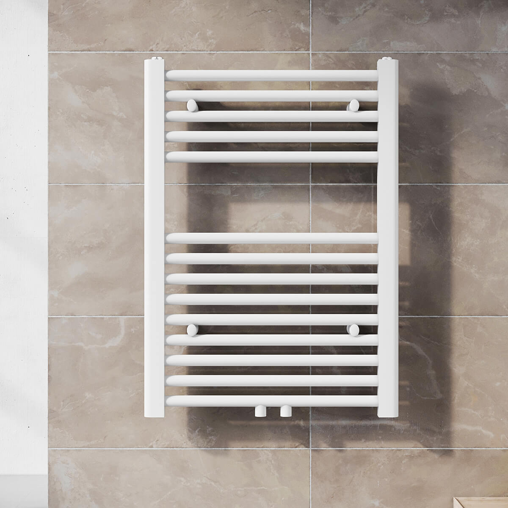
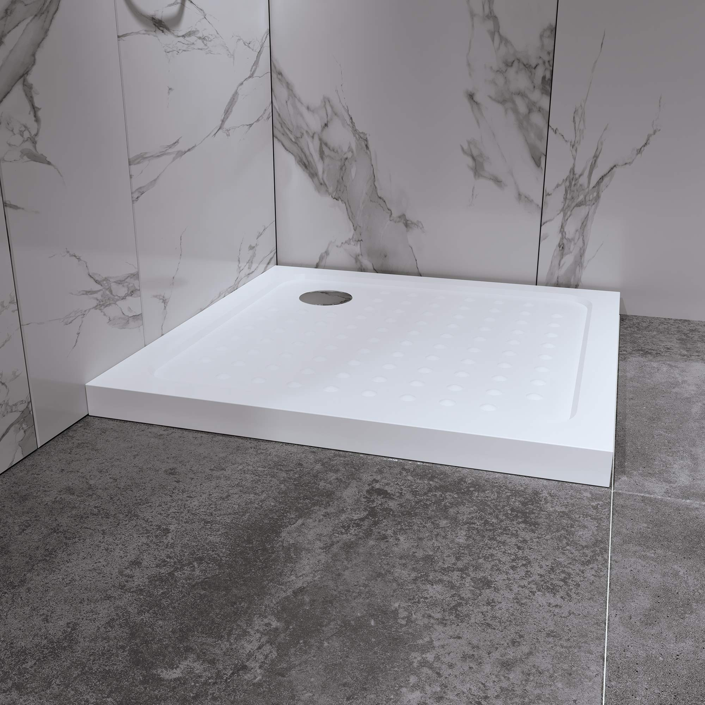
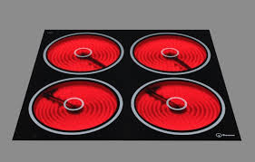
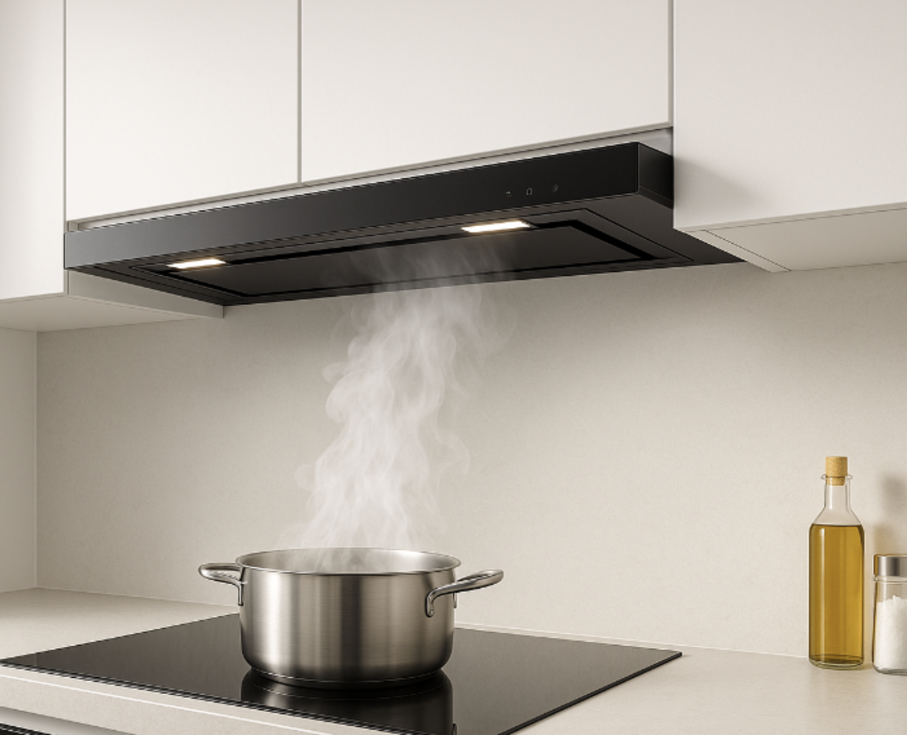
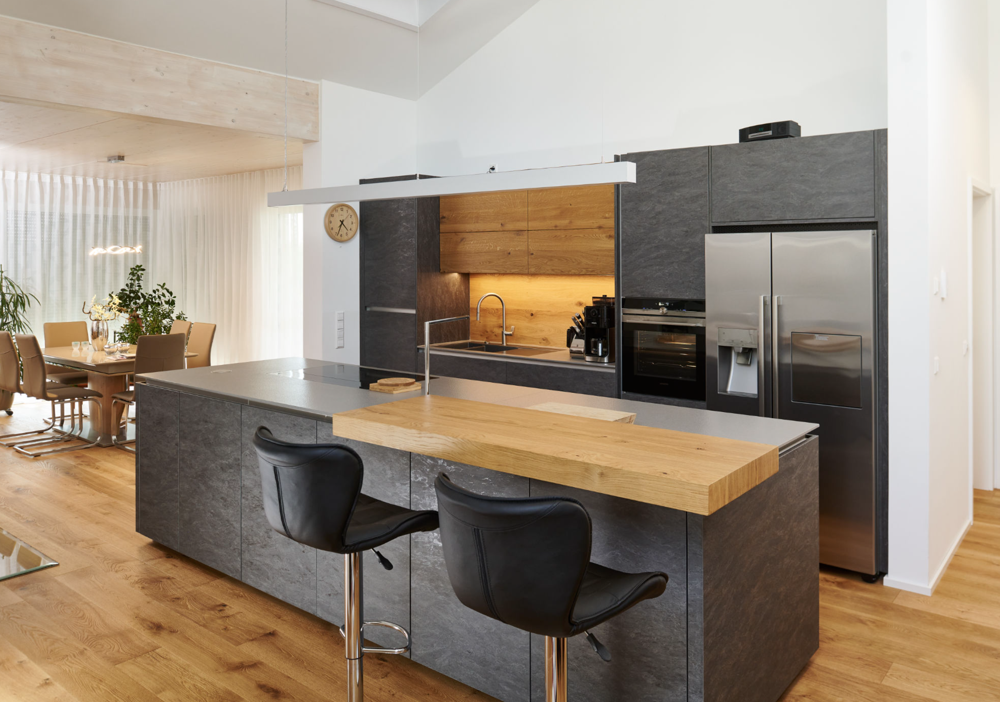
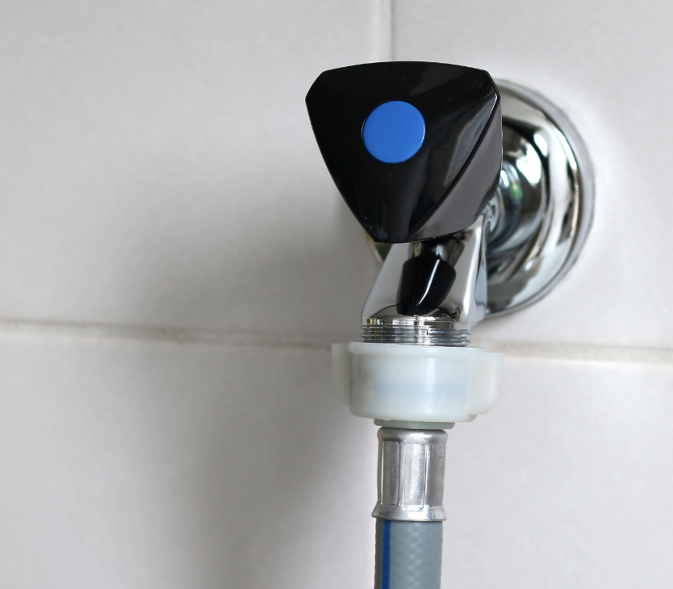

# Spanneneinordnung

ℹ️Fülle das so gut aus wie du es weißt. Wenn du fragen helfen wir dir gerne.

<form action="#" method="get">

<table class="merkmal-table">
  <thead>
    <tr>
      <th class="group-title" colspan="2">Merkmalgruppe 1: Bad/WC/Gäste-WC</th>
    </tr>
    <tr>
      <th class="subheader">➖ Wohnwertmindernde Merkmale</th>
      <th class="subheader">➕ Wohnwerterhöhende Merkmale</th>
    </tr>
  </thead>
  <tbody>
    <tr>
      <td>
        
<label><input type="checkbox" name="N_1_26"> Kein Handwaschbecken in Bad oder WC oder im Bad nur ein kleines Handwaschbecken (Außenmaß 50 cm breit oder weniger) <i>[bezieht sich nicht auf Gäste-WCs]</i></label>

        
<label><input type="checkbox" name="N_1_27"> WC ohne Lüftungsmöglichkeit und Entlüftung <i>[bezieht sich nicht auf Gäste-WCs]</i></label>

        
<label><input type="checkbox" name="N_1_28"> Dielenfußboden im Bad (wenn nicht feuchtraumgeeignet) <i>[bezieht sich nicht auf Gäste-WCs]</i></label>

        
<label><input type="checkbox" name="N_1_112"> Bad nicht beheizbar oder Holz-/Kohleheizung oder Elektroheizstrahler <i>[bezieht sich nicht auf Gäste-WC]</i></label>

        
<label><input type="checkbox" name="N_1_30"> Keine ausreichende Warmwasserversorgung (z.B. keine zentrale Warmwasserversorgung, kein Durchlauferhitzer, kein Boiler &gt; 60 Liter) <i>[bezieht sich nicht auf Gäste-WCs]</i></label>

        
<label><input type="checkbox" name="N_1_31"> Freistehende Badewanne mit oder ohne Verblendung und ohne separate Dusche in nicht modernisiertem Bad</label>

        
<label><input type="checkbox" name="N_1_32"> Wände nicht ausreichend im Spritzwasserbereich von Waschbecken, Badewanne und/oder Dusche gefliest/geschützt <i>[bezieht sich nicht auf Gäste-WCs]</i></label>

        
<label><input type="checkbox" name="N_1_89">ℹ️Wenn du kein Fenster im Bad hast, dann hier anklicken Bad mit WC ohne Fenster; gilt nicht für die Baualtersklasse 1973 bis 1990 Ost</label>

        
<label><input type="checkbox" name="N_1_91">ℹ️Könnte sein, wenn du nur eine Badewanne hast und in einer unrenovierten Wohnung wohnst Keine Duschmöglichkeit (z.B. kein Spritzwasserschutz, keine Duschkopfhalterung)</label>

        
<label><input type="checkbox" name="N_1_90"> Kleines Bad (Grundfläche kleiner als 4 m²); gilt nicht für die Baualtersklasse 1973 bis 1990 Ost</label>

      </td>
      <td>
        
<label><input type="checkbox" name="P_1_1"> Sehr großes Waschbecken (Außenmaß mindestens 80 cm breit) oder Doppelhandwaschbecken oder zwei getrennte Waschbecken <i>[bezieht sich nicht auf Gäste-WCs]</i></label>

        
<label><input type="checkbox" name="P_1_2"> Besondere und hochwertige Ausstattung (z.B. hochwertige Sanitärausstattung, hochwertige Badmöbel, Eckwanne, Rundwanne, Echtglastrennwand, Regendusche) <i>[bezieht sich nicht auf Gäste-WCs]</i></label>

        
<label><input type="checkbox" name="P_1_4">ℹ️Wahrscheinlich nicht. Wenn die Belüftung die ganze zeit geht, dann zählt das nicht. Innen liegendes Bad mit moderner, gesteuerter Entlüftung (z.B. mittels Feuchtigkeitssensor) <i>[bezieht sich nicht auf Gäste-WCs]</i></label>

        
<label><input type="checkbox" name="P_1_94"> Zweites WC in der Wohnung oder Bad und WC getrennt</label>

        
<label><input type="checkbox" name="P_1_95"> Mindestens ein Bad mit Grundfläche größer als 8 m² <i>[bezieht sich nicht auf Gäste-WCs]</i></label>

        
<label><input type="checkbox" name="P_1_96"> Fußbodenheizung <i>[bezieht sich nicht auf Gäste-WCs]</i></label>

        
<label><input type="checkbox" name="P_1_97">ℹ️Wahrscheinlich nein  Wandbekleidung und Bodenbelag hochwertig (gilt nicht für die Baualtersklassen ab 2010) <i>[bezieht sich nicht auf Gäste-WCs]</i></label>

        
<label><input type="checkbox" name="P_1_3"> Wandhängendes WC mit in der Wand eingelassenem Spülkasten (gilt nicht für die Baualtersklassen ab 2002) oder hochwertiges Stand-WC <i>[bezieht sich nicht auf Gäste-WCs]</i></label>

        
<label><input type="checkbox" name="P_1_6">ℹ️Ankreuzen wenn du diese Heizung im Bad hast  Strukturheizkörper als Handtuchwärmer im Bad (gilt für Baualtersklassen bis einschließlich 2001); sofern zusätzlich elektrisch betreibbar: alle Baujahre <i>[bezieht sich nicht auf Gäste-WCs]</i></label>

        
<label><input type="checkbox" name="P_1_93"> Von der Badewanne getrennte zusätzliche Duschtasse oder -kabine</label>

        
<label><input type="checkbox" name="P_1_108">ℹ️Eine Duschtasse ist das weiße Ding am Boden der dusche. Wenn das sehr niedrig ist dann das hier ankreuzen. Wahrscheinlich ist es das nicht. 
		
		
		Bodengleiche Dusche (auch flache Duschtasse mit einer Tiefe von bis zu 3 cm)</label>

      </td>
    </tr>
  </tbody>
</table>

&nbsp;

<table class="merkmal-table">
  <thead>
    <tr>
      <th class="group-title" colspan="2">Merkmalgruppe 2: Küche</th>
    </tr>
    <tr>
      <th class="subheader">➖ Wohnwertmindernde Merkmale</th>
      <th class="subheader">➕ Wohnwerterhöhende Merkmale</th>
    </tr>
  </thead>
  <tbody>
    <tr>
      <td>
        
<label><input type="checkbox" name="N_2_33"> Küche ohne Fenster und ohne ausreichende Entlüftung</label>

        
<label><input type="checkbox" name="N_2_34"> Keine Kochmöglichkeit oder Gas-/Elektroherd ohne Backofen</label>

        
<label><input type="checkbox" name="N_2_35"> Keine Spüle</label>

        
<label><input type="checkbox" name="N_2_36"> Keine ausreichende Warmwasserversorgung (z. B. keine zentrale Warmwasserversorgung, kein Durchlauferhitzer, kein Boiler)</label>

        
<label><input type="checkbox" name="N_2_37"> Küche nicht beheizbar oder Holz-/Kohleheizung</label>

        
<label><input type="checkbox" name="N_2_38"> Geschirrspüler in der Küche nicht stellbar oder anschließbar</label>

        
<label><input type="checkbox" name="N_2_109"> Keine Wandfliesen oder vergleichbarer Wandschutz im Arbeitsbereich</label>

      </td>
      <td>
        
<label><input type="checkbox" name="P_2_8">ℹ️Wahrscheinlich nicht Hochwertige Fliesen, hochwertiges Linoleum, hochwertiges Feuchtraumlaminat, Parkett, Terrazzo als Bodenbelag jeweils in gutem Zustand (gilt für Baualtersklassen bis einschließlich 2009)</label>

        
<label><input type="checkbox" name="P_2_12"> Separate Küche mit mind. 14 m² Grundfläche</label>

        
<label><input type="checkbox" name="P_2_7"> Einbauküche mit Ober- und Unterschränken sowie Herd und Spüle</label>

        
<label><input type="checkbox" name="P_2_10">ℹ️Ein Ceran-Kochfeld sieht so aus. Vielleicht hat es bei dir auch nur zwei Platten. Ceran-Kochfeld oder Induktions-Kochfeld (gilt für Baualtersklassen bis einschließlich 2001)</label>

        
<label><input type="checkbox" name="P_2_9">ℹ️Sieht zum Beispiel so aus. Wahrscheinlich hast du das nicht Dunstabzug</label>

        
<label><input type="checkbox" name="P_2_11"> Kühlschrank, Tiefkühlschrank/-truhe oder Geschirrspüler</label>

        
<label><input type="checkbox" name="P_2_110">ℹ️Das sieht so aus. Wahrscheinlich hast du das nicht   Freistehender Küchenblock mit Arbeitsfläche und Kochmöglichkeit oder Spüle</label>

      </td>
    </tr>
  </tbody>
</table>

&nbsp;

<table class="merkmal-table">
  <thead>
    <tr>
      <th class="group-title" colspan="2">Merkmalgruppe 3: Wohnung</th>
    </tr>
    <tr>
      <th class="subheader">➖ Wohnwertmindernde Merkmale</th>
      <th class="subheader">➕ Wohnwerterhöhende Merkmale</th>
    </tr>
  </thead>
  <tbody>
    <tr>
      <td>
        
<label><input type="checkbox" name="N_3_39"> Überwiegend Fenster mit Einfachverglasung (Doppel-Kastenfenster sind nicht gemeint)</label>

        
<label><input type="checkbox" name="N_3_42"> Unzureichende Elektroinstallation, z.B. keine ausreichende Elektrosteigleitung und/oder VDE-gerechte Elektroinstallation (z.B. kein FI-Schalter, Potentialausgleich)</label>

        
<label><input type="checkbox" name="N_3_43"> Elektroleitungen überwiegend sichtbar auf Putz</label>

        
<label><input type="checkbox" name="N_3_44"> Be- und Entwässerungsleitungen (Sanitärleitungen) überwiegend sichtbar auf Putz</label>

        
<label><input type="checkbox" name="N_3_46">ℹ️Nur ankreuzen wenn du den Anschluss nicht hast. Der Anschluss sieht so aus Waschmaschine weder in Bad noch Küche stellbar oder nicht anschließbar</label>

        
<label><input type="checkbox" name="N_3_47"> Schlechter Schnitt (z.B. gefangenes Zimmer und/oder Durchgangszimmer)</label>

        
<label><input type="checkbox" name="N_3_48"> Kein Balkon, (Dach-)Terrasse, Loggia und Winter-/Dachgarten (gilt nicht, wenn das Merkmal aus baulichen und/oder rechtlichen Gründen nicht möglich oder nicht zulässig ist)</label>

        
<label><input type="checkbox" name="N_3_115"> Bei Erdgeschosswohnung: Kein Einbruchs- und/oder Sichtschutzsystem an allen Fenstern der Wohnung (z. B. Gitter, Rollläden, Fensteralarm)</label>

      </td>
      <td>
        
<label><input type="checkbox" name="P_3_16"> Abstellraum innerhalb der Wohnung (mind. 1 m² Grundfläche) oder Einbauschrank</label>

        
<label><input type="checkbox" name="P_3_18"> ℹ️Wahrscheinlich nicht. Großer, geräumiger Balkon, (Dach-)Terrasse, Loggia oder Winter-/Dachgarten (ab 4 m² Grundfläche)</label>

        
<label><input type="checkbox" name="P_3_19">ℹ️Wahrscheinlich nicht. Überwiegend Fußbodenheizung</label>

        
<label><input type="checkbox" name="P_3_22">ℹ️Wahrscheinlich nicht. Aufwändige Decken- und/oder Wandverkleidung (z.B. Stuck, Täfelung) in gutem Zustand in der überwiegenden Anzahl der Wohnräume</label>

        
<label><input type="checkbox" name="P_3_24">← ℹ️Wahrscheinlich ja! Heizungsrohre überwiegend nicht sichtbar auf Putz (gilt für Baualtersklassen bis einschließlich 1990)</label>

        
<label><input type="checkbox" name="P_3_17"> Außen angebrachte Verschattungssysteme an überwiegender Anzahl der Fenster in den Wohnräumen (z.B. Rollläden)</label>

        
<label><input type="checkbox" name="P_3_20">ℹ️Wahrscheinlich nein Ein Wohnraum größer als 40 m² Grundfläche</label>

        
<label><input type="checkbox" name="P_3_98"> ← ℹ️Wahrscheinlich ja!  Barrierearme Wohnungsgestaltung (Schwellenfreiheit in der Wohnung, schwellenarmer Übergang zu Balkon/Terrasse sowie ausreichende Bewegungsfläche in der Wohnung)</label>

        
<label><input type="checkbox" name="P_3_21"> ℹ️Nein. Wir haben Laminat  Hochwertiges Parkett, Natur-/Kunststein, Fliesen oder gleichwertiger Boden/-belag in der überwiegenden Zahl der Wohnräume (inklusive Flur, ohne Küche, ohne Bad)</label>

        
<label><input type="checkbox" name="P_3_103"> Wohngebäude/Wohnungen die vor 2002 bezugsfertig geworden sind: überwiegend Wärmeschutzverglasung oder Schallschutzfenster (jeweils Einbau ab 2002)</label>

        
<label><input type="checkbox" name="P_3_105"> Zusätzliche Einbruchsicherung für die Wohnungstür (z.B. hochwertige Sperrbügel und/oder Türschlösser mit Mehrfachverriegelung) bei verstärkten Türen</label>

      </td>
    </tr>
  </tbody>
</table>

&nbsp;

<table class="merkmal-table">
  <thead>
    <tr>
      <th class="group-title" colspan="2">Merkmalgruppe 4: Gebäude</th>
    </tr>
    <tr>
      <th class="subheader">➖ Wohnwertmindernde Merkmale</th>
      <th class="subheader">➕ Wohnwerterhöhende Merkmale</th>
    </tr>
  </thead>
  <tbody>
    <tr>
      <td>
        
<label><input type="checkbox" name="N_4_65"><strong>←</strong> Treppenhaus und Eingangsbereich überwiegend in schlechtem Zustand</label>

        
<label><input type="checkbox" name="N_4_66"><strong>←</strong> Kein Abstellraum außerhalb der Wohnung zur alleinigen Nutzung ohne Zusatzkosten (z.B. kein abschließbarer Keller)</label>

        
<label><input type="checkbox" name="N_4_67"> Jederzeit von außen frei zugänglicher Hauseingang/Treppenhaus</label>

        
<label><input type="checkbox" name="N_4_68"> Schlechter Instandhaltungszustand (z.B. dauernde Durchfeuchtung des Mauerwerks - auch Keller -, große Putzschäden, erhebliche Schäden an der Dacheindeckung)</label>

        
<label><input type="checkbox" name="N_4_69"> ℹ️Nein Lage im Seitenflügel oder Quergebäude bei verdichteter Bebauung</label>

        
<label><input type="checkbox" name="N_4_70">  ℹ️Nein. Wir haben mehrere Aufzüge  Wohnung ab fünftem Obergeschoss ohne Personenaufzug (gilt nicht für die Baualtersklassen bis 1949)</label>

        
<label><input type="checkbox" name="N_4_104"> Keine Gegen-/Wechselsprechanlage mit elektrischem Türöffner</label>

      </td>
      <td>
        
<label><input type="checkbox" name="P_4_100"> ℹ️Nein. Die Fahrabstellplätze beim Müll kann man nicht abschließen Abschließbarer leicht zugänglicher Fahrradabstellraum innerhalb des Gebäudes oder Fahrradabstellplätze mit Anschließmöglichkeit außerhalb des Gebäudes auf dem Grundstück (ausreichend dimensioniert)</label>

        
<label><input type="checkbox" name="P_4_52"> ℹ️Nein. Zusätzliche und in angemessenem Umfang nutzbare Räume außerhalb der Wohnung in fußläufiger Entfernung (z.B. Gemeinschaftsraum, Gäste-Wohnung, Trockenraum)</label>

        
<label><input type="checkbox" name="P_4_56"> ℹ️Definitiv nein. Repräsentativer/s oder hochwertig sanierter/s Eingangsbereich und Treppenhaus (z.B. Spiegel, Marmor, exklusive Beleuchtung, hochwertiger Anstrich/Wandbelag, Läufer im gesamten Flur- und Treppenbereich)</label>

        
<label><input type="checkbox" name="P_4_58"> ℹ️Nein.  Überdurchschnittlich guter Instandhaltungszustand des Gebäudes, in dem sich die Wohnung befindet (z.B. erneuerte Fassade, Dach) (gilt für die Baualtersklassen bis einschließlich 2015)</label>

        
<label><input type="checkbox" name="P_4_59"> Gegen-/Wechselsprechanlage mit Videokontakt und elektrischem Türöffner</label>

        
<label><input type="checkbox" name="P_4_53"> ℹ️Nein. Wir haben mehr als fünft Stockwerke  Personenaufzug bei weniger als fünf Obergeschossen; gilt nicht für die Baualtersklassen ab 2010</label>

        
<label><input type="checkbox" name="P_4_113">← ℹ️Ja  Schwellenarmer Zugang zum Gebäude (max. eine Stufe) und zur Wohnung einschließlich Treppenhaus (max. eine Stufe)</label>

      </td>
    </tr>
  </tbody>
</table>

  <h3 class="energy-explainer">Erläuterung zu den folgenden energiespezifischen Eingaben</h3>
  
Die (End-)Energieverbrauchskennwerte beziehen sich auf Energie für Heizung und Warmwasser. Für die Einordnung eines Endenergiebedarfskennwertes sind die unten angegebenen Verbrauchsenergiekennwert-Grenzen um 20% zu erhöhen. Für Kennwerte ohne Berücksichtigung der dezentralen Warmwasserversorgung sind vor der Eingruppierung 20 kWh/(m²a) auf den (End-)Energiekennwert aufzuschlagen.

  
Bei Wohnungen, die in denkmalgeschützten Gebäuden gelegen sind, werden die wohnwertmindernden Merkmale zur energetischen Beschaffenheit dann nicht berücksichtigt, wenn die Umsetzung von energetischen Sanierungen gegen denkmalschutzrechtliche Belange verstoßen würde oder deren Umsetzung durch denkmalschutzrechtliche Auflagen unverhältnismäßig (teuer) wäre.

  <table class="merkmal-table energy-table">
    <thead>
      <tr>
        <th class="group-title" colspan="2">Energiebezogene Merkmale</th>
      </tr>
      <tr>
        <th class="subheader">➖ Wohnwertmindernde Merkmale</th>
        <th class="subheader">➕ Wohnwerterhöhende Merkmale</th>
      </tr>
    </thead>
    <tbody>
      <tr>
        <td>
          
<label><input type="radio" name="E_4_energie" value="N_4_1"> Unzureichende Wärmedämmung oder Heizanlage mit ungünstigem Wirkungsgrad (Einbau/Installation der Heizanlage vor 1995)</label>

          
<label><input type="radio" name="E_4_energie" value="N_4_2">
		  ← ℹ️Unser wert ist bei 160, ist aber abhängig von den Gebäuden. Wahrscheinlich hier
		  
		  
		  (End-)Energieverbrauchskennwert größer als 145 kWh/(m²a)</label>

          
<label><input type="radio" name="E_4_energie" value="N_4_3"> (End-)Energieverbrauchskennwert größer als 195 kWh/(m²a)</label>

          
<label><input type="radio" name="E_4_energie" value="N_4_4"> (End-)Energieverbrauchskennwert größer als 235 kWh/(m²a)</label>

        </td>
        <td>
          
<label><input type="radio" name="E_4_energie" value="P_4_5"> Wärmedämmung zusätzlich zur vorhandenen Bausubstanz oder Einbau/Installation einer modernen Heizanlage ab 2009 (wenn Bezugsfertigkeit des Gebäudes/der Wohnung vor diesem Zeitpunkt)</label>

          
<label><input type="radio" name="E_4_energie" value="P_4_6"> (End-)Energieverbrauchskennwert kleiner als 120 kWh/(m²a)</label>

          
<label><input type="radio" name="E_4_energie" value="P_4_7"> (End-)Energieverbrauchskennwert kleiner als 100 kWh/(m²a)</label>

          
<label><input type="radio" name="E_4_energie" value="P_4_8"> (End-)Energieverbrauchskennwert kleiner als 80 kWh/(m²a)</label>

        </td>
      </tr>
    </tbody>
  </table>
  
<label><input type="radio" name="E_4_energie" value="D_4_9" checked> keine Auswahl / energiespezifische Merkmale unbekannt</label>

<table class="merkmal-table">
  <thead>
    <tr>
      <th class="group-title" colspan="2">Merkmalgruppe 5: Wohnumfeld</th>
    </tr>
    <tr>
      <th class="subheader">➖ Wohnwertmindernde Merkmale</th>
      <th class="subheader">➕ Wohnwerterhöhende Merkmale</th>
    </tr>
  </thead>
  <tbody>
    <tr>
      <td>
        
<label><input type="checkbox" name="N_5_74"> ℹ️Du kannst das ankreuzen wenn das Fenster raus zur Stresemannstraße geht. Ansonsten nicht. Besonders lärmbelastete Lage der Wohnung (Die Wohnung liegt beispielsweise an einer Hauptverkehrsstraße oder im unmittelbaren Umfeld eines Flughafens und erfährt dadurch unangenehme Lärm- und Staubemissionen. Daneben können auch große Fabrik- und Industrieanlagen, aber auch Gewerbe-, Restaurant- und Partylärm Ursache für eine besonders lärmbelastete Lage sein.)*</label>

        
<label><input type="checkbox" name="N_5_75"> Besonders geruchsbelastete Lage</label>

        
<label><input type="checkbox" name="N_5_76"> ℹ️Nein. Wir haben Fahrabstellplätze beim Müll Keine Fahrradabstellmöglichkeit auf dem Grundstück</label>

      </td>
      <td>
        
<label><input type="checkbox" name="P_5_61"> ℹ️Du kannst das ankreuzen wenn du in Richtung Fernsehturm schaust Besonders ruhige Lage der Wohnung (Die Wohnung liegt beispielsweise an einer verkehrsberuhigten Straße, oder an einer parkähnlichen Anlage oder es gibt bauliche Einschränkungen für die Straßen, wie z.B. Poller, Verengung der Fahrbahn, Bepflanzung.)</label>

        
<label><input type="checkbox" name="P_5_63"> Aufwändig gestaltetes Wohnumfeld auf dem Grundstück (z.B. Kinderspielplatz – bei Bezugsfertigkeit des Gebäudes vor 2003, Sitzbänke oder Ruhezonen, gute Gehwegbefestigung mit Grünflächen und Beleuchtung)</label>

        
<label><input type="checkbox" name="P_5_64"> Vom Vermieter zur Verfügung gestelltes PKW-Parkplatzangebot in der Nähe (ausreichend dimensioniert)</label>

        
<label><input type="checkbox" name="P_5_101"> Garten zur alleinigen Nutzung/Mietergarten ohne Entgelt oder zur Wohnung gehörender Garten mit direktem Zugang</label>

      </td>
    </tr>
  </tbody>
</table>

* Hinweise auf bestehende Lärmbelastung von Wohngebäuden werden durch die Senatsverwaltung für Mobilität, Verkehr, Klimaschutz und Umwelt bereitgestellt. Die Strategischen Lärmkarten mit einer gebäudescharfen Darstellung der Fassadenpegel an lärmbeeinflussten Wohngebäuden sind auf der <a href="https://www.berlin.de/sen/uvk/umwelt/laerm/laermminderungsplanung-berlin/laermkarten/" target="_blank">Internetseite dieser Senatsverwaltung</a> veröffentlicht.

<a href="../ergebnis/" class="button button--white">Ortsübliche Vergleichsmiete bestimmen</a>←

</form>

